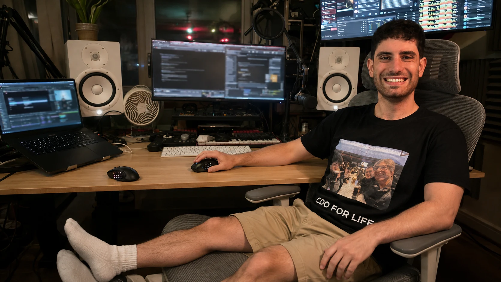

# Agentic Mouse

**The setup for the agentic future.**

Two mice. Twenty-four thumb buttons. I lean back, talk to agents, and keep the rest under my thumb.

My personal macOS setup, made public so you can explore it and build your own. — **Ethan S K**

[**Try the interactive walkthrough →**](https://ethansk.github.io/agentic-mouse/) · [Every button and mode](https://ethansk.github.io/agentic-mouse/mouse-map.html) · [Setup guide](docs/SETUP.md)



*My setup, reimagined with AI from my portrait and studio photos.*

## Take it for a spin

The website is a working browser demo of the mouse controls:

1. **Rotate either mouse.** Drag the models, then switch hands to try each thumb grid.
2. **Press a mode button.** The controls and lighting change to Utility, Keys, or the current app. Press Exit to return.
3. **Try the gestures.** Hold a wheel control and use Wheel up / Wheel down. Open Keys → Keypad to type a local example.

The labels, colours, printed-button crosswalk, repair markers, and mode transitions are generated from the native Swift source. The 3D hardware is recreated from product photographs. The demo does not control your Mac or access your microphone.

## What I use it for

| Gesture | What it does |
|---|---|
| Top button | Activate speech mode with VoiceInk++. DPI stays at 2,750. |
| Wheel click | Play or pause the current media. |
| Thumb button + wheel | Copy/paste, scroll horizontally, scrub YouTube, or use a mode-specific control. |
| App mode | Bring up controls for the frontmost app, including Codex, Chrome, VS Code, and Spotify. |
| Utility mode | Control windows, Spaces, brightness, zoom, and other utilities. |
| Keys → Keypad | Use arrows and editing keys, or type with classic phone-style multi-tap. |
| Legend toggle / Exit | Show the Default map, or leave an active mode. Each mouse keeps its own state. |

[Open the generated map](https://ethansk.github.io/agentic-mouse/mouse-map.html) for the exact button numbers and every app mode. Some controls carry a **Needs repair** marker from my latest physical report; a browser demo is not proof that the corresponding Mac action works.

## My setup

| Part | What I use |
|---|---|
| Left hand | Razer Naga Left-Handed Edition |
| Right hand | Corsair Scimitar Elite Wireless SE |
| Dictation | VoiceInk++ |
| Chair | Hbada E3 Pro, grey with footrest |
| Desk | FlexiSpot E7 Pro with a bamboo top |

The mice share a physical action layout, with their own printed numbers and mirrored presentation. I can switch hands without changing how I work.

## Build the app

Requires **macOS 13 or later**, **Swift 5.10 or later**, **Node.js 20 or later**, and **Python 3**. Building and running the hardware-free tests does not require either mouse or the proprietary iCUE SDK.

```sh
git clone https://github.com/EthanSK/agentic-mouse.git
cd agentic-mouse
make check
make app
```

`make app` packages `build/AgenticMouse.app`. It does **not** install it or change your mouse settings.

For real hardware, follow the [setup guide](docs/SETUP.md): configure the neutral button transports, provide the iCUE SDK for Corsair lighting, review the generated Karabiner runtime rules, and grant the required macOS permissions. This is a personal setup to commission, not a universal plug-and-play installer.

<details>
<summary>Read-only diagnostics</summary>

```sh
swift run agentic-mouse-doctor config
swift run agentic-mouse-doctor mapping
swift run agentic-mouse-doctor icue
swift run agentic-mouse-doctor razer
make simulate
```

These commands inspect or simulate. They do not rewrite iCUE profiles or system settings. The doctor's separate lighting tests require explicit flags.

</details>

## Update the website

```sh
make test-site
python3 -m http.server 8841 --directory .build/site
```

Open [localhost:8841](http://localhost:8841/). The build runs the native mode coordinator with inert outputs and writes a fresh website to `.build/site`.

Every push to `main` automatically rebuilds, tests, and publishes the website through [GitHub Actions](.github/workflows/showcase.yml). Pull requests build and test without publishing. Change the app definitions, push the change, and the public map follows; there is no second website button table to update.

The site reflects the source that was pushed. Local changes and private machine settings are not uploaded automatically. See [website maintenance](docs/SHOWCASE.md) for the generation boundary and visual QA checklist.

## How it fits together

| Layer | Owner |
|---|---|
| Corsair DPI, profiles, and neutral transports | iCUE |
| Razer hardware transports | Naga onboard profile |
| Exact-device input routing | Karabiner-Elements |
| Modes, HUDs, action definitions, and temporary lighting | Agentic Mouse |

Agentic Mouse does not edit vendor profile databases. Its runtime modes restore the normal mapping on exit, and session-lock handling cancels pending actions. Configuration and private device details stay outside Git.

## Go deeper

- [Setup](docs/SETUP.md) — build requirements, SDK, hardware, and permissions.
- [Architecture](docs/ARCHITECTURE.md) — native components and responsibilities.
- [Karabiner](Karabiner/README.md) — semantic actions and exact-device adapters.
- [Limitations](docs/LIMITATIONS.md) · [Live proof](docs/LIVE-PROOF.md) — what is verified and what still needs physical acceptance.
- [Recovery](docs/RECOVERY.md) — return to normal if something goes wrong.

MIT licensed. [Read the license](LICENSE).
